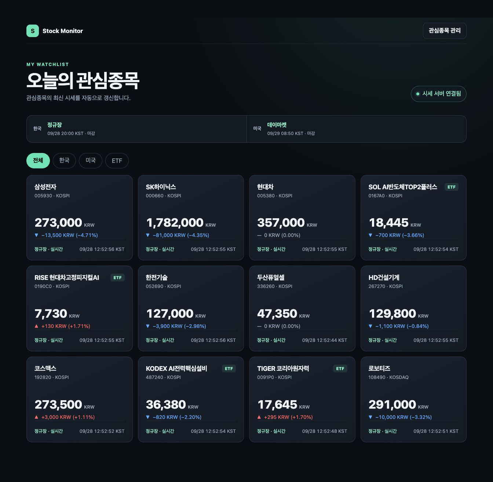
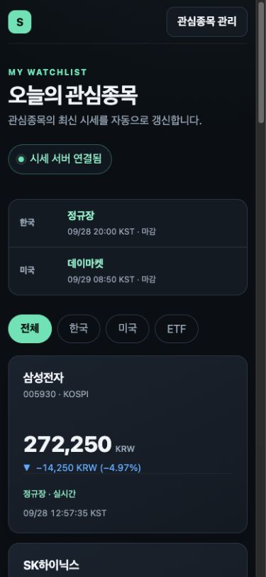
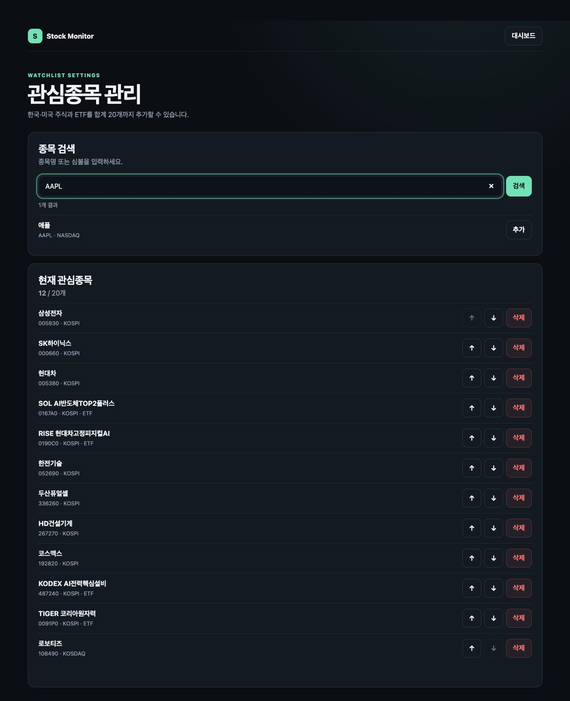
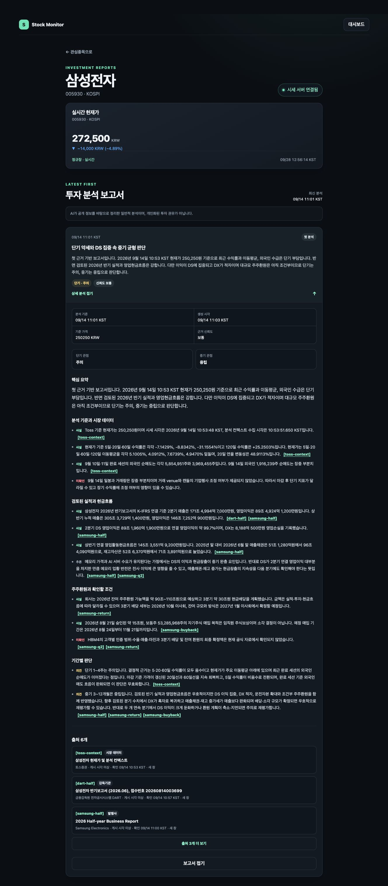

# Stock Monitor

남는 갤럭시 스마트폰을 **홈 LAN 전용 주가 모니터**로 사용하는 개인 프로젝트입니다. Termux에서 실행되는 단일 Python 서버가 Toss Securities Open API의 한국·미국 주식 및 ETF 시세를 받아 브라우저에 전달합니다. 관심종목을 관리하고, Mac에서 명시적으로 생성한 근거 연결형 투자 보고서를 종목별로 확인할 수 있습니다.

## 주요 기능

- **실시간 대시보드:** 관심종목 최대 20개, 전체·한국·미국·ETF 필터, 현재가와 전일 대비, KST 기준 시장 세션·다음 개장/마감 시각을 표시합니다. 시세가 지연되거나 연결이 끊기면 마지막 가격과 연결 상태를 함께 보여줍니다.
- **관심종목 관리:** 종목명·심볼 검색, 추가·삭제·순서 변경을 지원합니다. 중복 등록과 20개 초과는 차단합니다.
- **종목 상세와 보고서:** 실시간 시세 아래에 최신순 보고서를 표시합니다. Mac의 `$stock-report`를 실행할 때만 Toss 데이터와 공시·IR·뉴스 원문을 조사하며, 단기·중기 관점과 신뢰도, 사실·추론·의견·미확인 구분 및 출처를 저장합니다.

## 화면



<details>
<summary>모바일 대시보드 · 관심종목 관리 · 종목 상세 보기</summary>







</details>

> 2026년 9월 28일 KST에 실행 중인 서비스에서 캡처했습니다. 가격과 시장 상태는 촬영 당시 값입니다.

## 동작 구조

```text
Toss REST ── 초기 시세·시장 일정·전일 종가 ──┐
Toss WebSocket ── 실시간 체결 ──────────────┤ FastAPI 단일 프로세스
                                            └─ 메모리 시세 상태 ─ SSE ─ 브라우저
SQLite ── 종목 카탈로그·관심종목·전일 종가·보고서/출처
Mac Codex ── 분석 컨텍스트 조회·보고서 저장 (Bearer 토큰) ── FastAPI
```

FastAPI·Uvicorn, Jinja2와 경량 JavaScript, SQLite(WAL)를 사용합니다. 시작과 재연결 시 REST로 시세를 재동기화하고, WebSocket 장애에는 재접속하며 화면에는 데이터 신선도를 드러냅니다. 시장 시간은 Toss 거래일·세션 정보를 기준으로 판단합니다. 체결 이력은 장기 저장하지 않습니다.

보고서 작성은 서버와 분리된 수동 작업입니다. Codex의 정량·펀더멘털·위험 검토 에이전트는 읽기 전용으로 조사하고 주 에이전트가 결과를 검증해 저장합니다. 스마트폰은 Mac이 꺼져 있어도 시세를 계속 제공하며, 보고서용 내부 API는 별도 Bearer 토큰으로 보호합니다. 보고서는 1년 보관하고 동일 `run_id` 재전송을 멱등 처리합니다.

## 시작하기

**요구 사항:** Python 3.12 또는 3.13, Toss Securities Open API 자격 증명과 허용 공인 IP. 상시 운영 환경은 Termux가 설치된 Android 스마트폰입니다.

```sh
python -m venv .venv
. .venv/bin/activate
python -m pip install -c constraints.txt -e .

mkdir -p "$HOME/.config/stock-monitor"
cp config/credentials.toml.example "$HOME/.config/stock-monitor/credentials.toml"
chmod 600 "$HOME/.config/stock-monitor/credentials.toml"
# credentials.toml에 client_id, client_secret을 직접 입력

stock-monitor diagnose-toss
stock-monitor sync-instruments
uvicorn stock_monitor.app:app --host 0.0.0.0 --port 8000 --workers 1
```

같은 Wi-Fi의 브라우저에서 `http://<스마트폰 LAN IP>:8000`으로 접속합니다. `diagnose-toss`와 `sync-instruments`는 새 Toss 토큰을 발급하므로 **서버 실행 전에** 수행합니다. 비밀값 입력, Termux 서비스·백업·재부팅 자동 시작은 [Termux 실행 가이드](docs/TERMUX.md)를 따릅니다.

보고서를 생성하려면 Mac에 `config/report-client.toml.example`을 바탕으로 설정 파일을 만들고, 스마트폰과 같은 `report_writer_token` 및 OpenDART 키를 설정합니다. 이후 Codex에서 `$stock-report 삼성전자` 또는 `$stock-report 관심종목 전체`를 실행합니다. 세부 절차는 [Termux 실행 가이드](docs/TERMUX.md#mac에서-투자-보고서-생성)에 있습니다.

## 개발과 운영

```sh
./scripts/check
```

개발 환경에서는 `python -m pip install -c constraints.txt -e '.[dev]'`로 검사 도구를 설치합니다. `scripts/check`는 Ruff 형식·린트, 오프라인 pytest, Shell·Git diff 검사를 실행하며 PR에서도 같은 검사와 비밀값 검사를 수행합니다. 상태 확인은 `/health/live`, `/health/configuration`, `/health/market-data`에서 할 수 있습니다. 운영은 Termux의 runit 서비스·일일 SQLite 백업을 사용합니다.

이 서비스는 **정보 확인용**이며 주문·계좌 기능, 로그인, 외부 인터넷 공개를 제공하지 않습니다. LAN 사용자는 관심종목을 조회·편집할 수 있으므로 공유기 포트포워딩 없이 신뢰하는 홈 네트워크에서만 실행합니다.

제품 범위와 완료 조건은 [프로젝트 계획](docs/PROJECT_PLAN.md), 브랜치·PR·배포 규칙은 [개발 가이드](docs/DEVELOPMENT.md), 에이전트 작업 원칙은 [AGENTS.md](AGENTS.md)에 있습니다.
